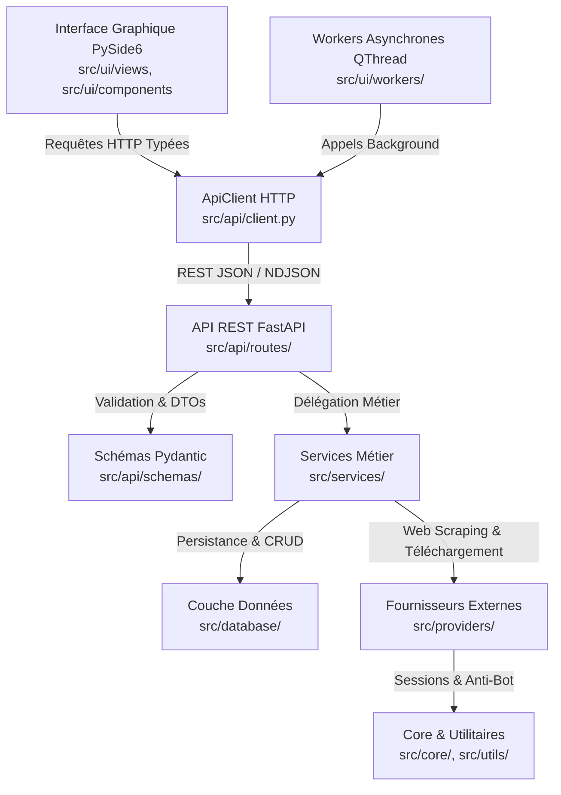

# Architecture du Projet : SIMS 4 Mods Manager

Ce document décrit en détail l'architecture logicielle de l'application **SIMS 4 Mods Manager**, structurée selon les principes de la **Clean Architecture** et du découpage par responsabilité unique (**SRP**).

---

## 🏛️ Vue d'Ensemble des Couches

L'application est conçue pour garantir un découplage total entre l'interface utilisateur, l'orchestration des données, les services métier et la persistance :



---

## 📂 Arborescence Détaillée et Rôle des Fichiers

```text
SIMS4-Mods-Manager/
├── pyproject.toml                     # Définition du projet, dépendances uv et outils
├── run.py                             # Point d'entrée unique (GUI PySide6 ou --server API)
├── README.md                          # Guide rapide d'installation et d'utilisation
├── INSTRUCTIONS.md                    # Guide technique des règles métier et retours d'expérience
├── documentation/                     # Dossier de documentation exhaustif
│   ├── architecture.md                # (Ce document) Principes d'architecture et arborescence
│   ├── api_reference.md               # Spécification complète des endpoints REST & payloads
│   ├── modules_and_classes.md         # Diagrammes de liaisons, classes et séquences
│   └── services_and_providers.md      # Détails des services métier et intégrations providers
├── src/
│   ├── i18n.py                        # Singleton I18nManager & fonction tr() pour internationalisation
│   ├── locales/                       # Catalogues JSON de traduction (100% de parité de clés)
│   │   ├── fr.json                    # Français (défaut)
│   │   ├── en.json                    # Anglais
│   │   └── es.json                    # Espagnol
│   ├── api/                           # Présentation API REST (FastAPI)
│   │   ├── app.py                     # Initialisation FastAPI, middlewares CORS, cycle de vie
│   │   ├── client.py                  # Client HTTP (ApiClient) consommé par l'UI PySide6
│   │   ├── deps.py                    # Injection de dépendances FastAPI (get_db)
│   │   ├── server.py                  # Gestionnaire du serveur Uvicorn (thread daemon ou autonome)
│   │   ├── schemas/                   # Schémas Pydantic (DTOs typés par domaine)
│   │   │   ├── accounts.py            # Sessions de connexion et statuts providers
│   │   │   ├── catalog.py             # Recherche, catalogue, dépendances, installation
│   │   │   ├── installed.py           # Mods installés, activation/désactivation, scan
│   │   │   ├── updates.py             # Détection différentielle de version et mises à jour
│   │   │   ├── settings.py            # Chemins configurés, purges et options
│   │   │   ├── logs.py                # Journalisation et niveaux de criticité
│   │   │   └── system.py              # Santé système, diagnostic matériel et jeux
│   │   └── routes/                    # Routeurs FastAPI modulaires
│   │       ├── accounts_router.py     # Endpoints /api/accounts
│   │       ├── catalog_router.py      # Endpoints /api/catalog
│   │       ├── catalog_queries.py     # Constructeur de requêtes SQL & filtres avancés catalogue
│   │       ├── catalog_reports_router.py # Signalements et interpellations forum
│   │       ├── catalog_install_router.py # Pipeline d'installation unitaire & dépendances
│   │       ├── installed_mods_router.py # Endpoints /api/installed
│   │       ├── mod_updates_router.py  # Endpoints /api/updates
│   │       ├── settings_router.py     # Endpoints /api/settings
│   │       ├── logs_router.py         # Endpoints /api/logs
│   │       └── system_router.py       # Endpoints /api/system
│   ├── services/                      # Couche Métier / Cas d'usage purs
│   │   ├── catalog_sync_service.py    # Scraping multithreadé LoversLab, progression & SyncTracker
│   │   ├── mod_installer_service.py   # Validation DBPF, extraction et règle de profondeur .ts4script
│   │   ├── mod_update_service.py      # Comparaison version/date, mise à jour unitaire & en lot
│   │   ├── mod_toggle_service.py      # Activation / désactivation propre avec extension .disabled
│   │   ├── dependency_resolver.py     # Résolution des 4 statuts de dépendances de mods
│   │   ├── game_detector.py           # Détection Sims 4 multilingue (Documents, OneDrive) & Resource.cfg
│   │   ├── game_launcher.py           # Détection exécutables (registre, Steam) & lancement de processus
│   │   └── game_service.py            # Façade unifiée pour la détection et le lancement
│   ├── database/                      # Couche Persistance (SQLAlchemy + SQLite)
│   │   ├── connection.py              # Engine SQLite, session factory, création du schéma
│   │   ├── models.py                  # Entités ORM (CatalogMod, InstalledMod, AccountSession, AppSettings)
│   │   └── manager.py                 # DatabaseManager singleton, opérations CRUD, maintenance
│   ├── providers/                     # Connecteurs de contenu externes
│   │   ├── base.py                    # Classe abstraite BaseSourceProvider (types DTOs & unifiés)
│   │   ├── loverslab/                 # Fournisseur LoversLab
│   │   │   ├── scraper.py             # Orchestration réseau et scraping LoversLab
│   │   │   ├── parsers.py             # Fonctions pures de parsing HTML BeautifulSoup (galeries, desc, carousels)
│   │   │   ├── downloader.py          # Résolution de liens IPS, scoring candidats & téléchargement
│   │   │   └── matchers.py            # Fonctions de détection (is_wickedwhims_name, is_nisa_name)
│   │   └── patreon/                   # Fournisseur Patreon
│   │       ├── provider.py            # Implémentation PatreonProvider via API curl_cffi
│   │       └── __init__.py            # Export du provider
│   ├── core/                          # Fondations techniques partagées
│   │   ├── config.py                  # AppConfig (chemins par défaut, cache, persistence config.json)
│   │   ├── constants.py               # Énumérations standardisées (ProviderType, RequirementStatus, PatreonStatus)
│   │   ├── dto.py                     # Data Transfer Objects typés (ModDetailsDTO, DownloadResultDTO)
│   │   ├── exceptions.py              # Hiérarchie d'exceptions métier typées (Sims4ManagerError...)
│   │   ├── session_manager.py         # Pool de sessions HTTP curl_cffi & profil Playwright
│   │   └── shutdown_manager.py        # Arrêt gracieux des threads d'arrière-plan
│   ├── ui/                            # Interface Graphique PySide6
│   │   ├── app.py                     # Fenêtre principale (MainWindow), navigation et layout
│   │   ├── components/                # Éléments réutilisables (ModCard, FilterBar, ImageViewerModal, ImageCache...)
│   │   │   ├── responsive_card_grid.py # Grille de cartes réactive s'adaptant à la largeur d'écran
│   │   │   ├── dependencies_summary_widget.py # Widget partagé de prérequis pour ModCard et InstalledCard
│   │   │   ├── dependency_card.py     # Carte unifiée de dépendance
│   │   │   ├── dependency_section_builder.py # Constructeur de sections de prérequis & DLCs
│   │   │   ├── account_card.py        # Carte réutilisable de statut et d'actions de compte
│   │   │   ├── dialog_helper.py       # Standardisation des dialogues modaux (thème sombre & i18n)
│   │   │   ├── filter_bar.py          # Barre de recherche et filtrage multi-critères
│   │   │   ├── mod_card.py            # Tuile de catalogue
│   │   │   ├── installed_card.py      # Tuile de mod installé
│   │   │   ├── image_viewer_modal.py  # Visionneuse de galerie de screenshots plein écran
│   │   │   └── provider_drawer/       # Tiroir satellite rétractable (loverslab_card, patreon_card)
│   │   ├── views/                     # Vues pleines pages (Catalogue, Détails, Mes Mods, Mises à jour, Logs, Paramètres, Comptes)
│   │   └── workers/                   # Threads d'arrière-plan PySide6 (QThread)
│   │       ├── catalog_workers.py     # SyncTriggerWorker, InstallWorker
│   │       └── detail_workers.py      # FetchDetailsWorker, GalleryBatchWorker, DescriptionImageLoaderWorker
│   └── utils/                         # Utilitaires techniques transverses
│       ├── archive.py                 # Décompression (.zip, .rar, .7z)
│       ├── cache_utils.py             # Hachage MD5 d'URL, inférence d'extensions et résolution de chemins de cache
│       ├── file_utils.py              # Nettoyage et assainissement strict des noms de dossiers et fichiers
│       ├── image_cache.py             # Cache mémoire LRU de pixmaps à budget d'octets fixe (128 Mo)
│       ├── logger.py                  # Système de log avec émetteur temps réel Qt et logs rotatifs
│       ├── mod_matcher.py             # Algorithmes de matching de titres et tokens
│       ├── network.py                 # Allocation dynamique de port libre et stream_download
│       ├── resource_cfg.py            # Modèle de configuration Resource.cfg
│       └── version_utils.py           # Analyse flexible de dates multiformats et normalisation de versions
└── tests/                             # Suite de tests automatisée (186 tests unitaires & intégration - 100% vert)
    ├── conftest.py                    # Fixtures pytest (FastAPI TestClient, SQLite temporaire, QApplication)
    ├── core/                          # Tests des constantes, exceptions et DTOs
    ├── api/                           # Tests des routes REST et de l'ApiClient
    ├── database/                      # Tests CRUD, intégrité, pragmas WAL et pooling de sessions
    ├── services/                      # Tests unitaires des services métier
    ├── providers/                     # Tests des connecteurs externes et des parsers HTML purs
    ├── ui/                            # Tests des composants PySide6, grilles, dialogues et workers
    └── utils/                         # Tests des utilitaires (i18n, matching, cache LRU, versions, dates)
```

---

## 🛡️ Règles Architecturales Strictes

1. **Aucun Import Direct BDD depuis l'UI** : L'interface graphique PySide6 n'importe jamais `DatabaseManager` ni `src.database.models`. Elle consomme exclusivement les données via `ApiClient` (`src.api.client.py`).
2. **Pas de Logique Métier dans les Routeurs** : Les fichiers `src/api/routes/*_router.py` sont de simples contrôleurs HTTP. Ils reçoivent les requêtes, valident les schémas Pydantic, appellent la couche `src/services/` et retournent les réponses formatées.
3. **Immutabilité des Schémas (DTOs)** : Les schémas d'entrée/sortie sont isolés dans `src/api/schemas/` et ne dépendent jamais des modèles ORM SQLAlchemy.
4. **Zéro Fichier Shim ou Déprécié** : Tous les modules pointent directement sur les emplacements canoniques, éliminant toute dette technique liée à des fichiers de transition.
5. **Gestion de l'Arrêt Propre (Graceful Shutdown)** : Tous les processus asynchrones vérifient périodiquement `ShutdownManager.is_shutting_down()` pour éviter toute fuite mémoire ou plantage de threads orphelins.
