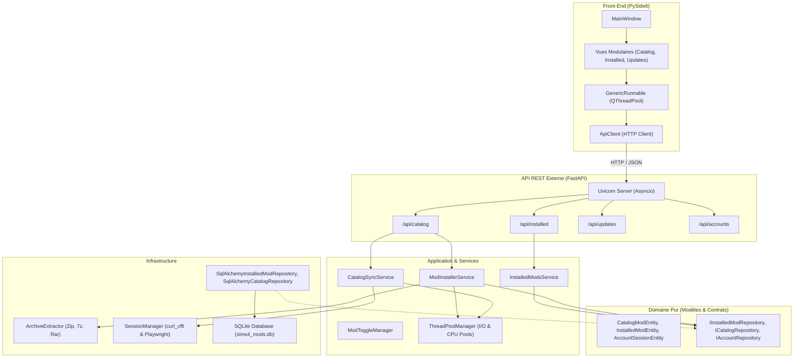

# Architecture Logicielle & Standards de Conception (SIMS 4 Mods Manager)

Ce document détaille l'architecture logicielle de l'application **SIMS 4 Mods Manager**, structurée selon les principes de la **Clean Architecture** (Architecture Hexagonale / Onion Architecture) et de la Programmation Orientée Objet (POO) avancée.

---

## 1. Principes Fondamentaux d'Architecture

L'application repose sur cinq piliers stricts :

1. **Séparation Stricte des Couches** :
   - Le Domaine (`src/domain/`) est totalement agnostique des bibliothèques externes et des frameworks.
   - L'Infrastructure (`src/infrastructure/`) implémente les détails techniques (SQLAlchemy, SQLite, compression d'archives, réseau HTTP).
   - L'Application (`src/application/`) et les Services orchestrent les cas d'usage métier.
   - L'API REST (`src/api/`) sert d'interface publique externe exposée au Front-End.
   - L'Interface Graphique (`src/ui/`) est strictement découplée et consomme exclusivement l'API REST.

2. **Étanchéité des API (Front -> Back et Back -> Back)** :
   - **Front vers Back** : Le Front PySide6 ne réalise aucun import direct des couches de base de données ou des modèles ORM. Chaque action transite par le client HTTP typé (`ApiClient`).
   - **Back vers Back** : Les services applicatifs et les contrôleurs API communiquent avec les composants d'infrastructure (base de données, providers) exclusivement au travers de contrats d'interfaces internes (`IInstalledModRepository`, `ICatalogRepository`, `IAccountRepository`).
   - Les API internes ne sont pas exposées sur FastAPI et sont inaccessibles par requête HTTP directe.

3. **Programmation Orientée Objet & Patrons de Conception** :
   - **Repository Pattern** : Abstraction de l'accès aux données avec gestion des transactions et typage domaine.
   - **Service / Interactor Pattern** : Encapsulation de la logique métier.
   - **Strategy Pattern** : Gestion unifiée et polymorphe des formats d'archives (ZIP, RAR, 7Z) via `BaseArchiveHandler` et `ArchiveExtractor`.
   - **Data Transfer Objects (DTOs)** : Entités typées Pydantic v2 pour les échanges API et Dataclasses pour le Domaine.

4. **Concurrence Hybride & Optimisation des Threads** :
   - **Asyncio Natif** : Pour l'API FastAPI et Uvicorn, garantissant un traitement non-bloquant des requêtes web et du streaming d'événements (NDJSON).
   - **ThreadPoolManager Centralisé (Backend)** : Gestionnaire borné évitant la multiplication incontrôlée de `threading.Thread` sauvages. Pools isolés pour les entrées/sorties (`I/O pool`) et les calculs lourds (`CPU pool` pour 7z/zip/hash).
   - **QThreadPool & GenericRunnable (Front-End PySide6)** : Exécution asynchrone des tâches UI via un pool de threads partagé et signaux Qt typés (`finished`, `error`, `progress`).

5. **Cycle de Vie & Arrêt Gracieux** :
   - Coordination centralisée par `ShutdownManager` avec enregistrement de callbacks pour vider les files, fermer les connexions HTTP et annuler les futures en cours sans fuite mémoire.

---

## 2. Diagramme Global des Couches (Mermaid)

---

## 3. Détail de la Concurrence

### Pool Backend (`ThreadPoolManager`)
- **IO Worker Pool** : `max_workers = 8`. Utilisé pour les téléchargements de fichiers, les requêtes HTTP distantes et la synchronisation de catalogue.
- **CPU Worker Pool** : `max_workers = os.cpu_count()`. Utilisé pour la décompression d'archives, le calcul de hash SHA-256 et le parsing intensif.
- **Cycle de Vie** : Hooké sur `ShutdownManager.trigger_shutdown()`. À la fermeture de l'application, toutes les futures actives sont annulées immédiatement.

### Pool Front-End (`GenericRunnable` & `QThreadPool`)
- Utilisation de `QThreadPool.globalInstance()`.
- La classe `GenericRunnable(QRunnable)` capture les exceptions d'arrière-plan et relaie les événements via `WorkerSignals` (signaux Qt `finished`, `error`, `progress`) directement marshalisés sur le thread principal de l'UI.
