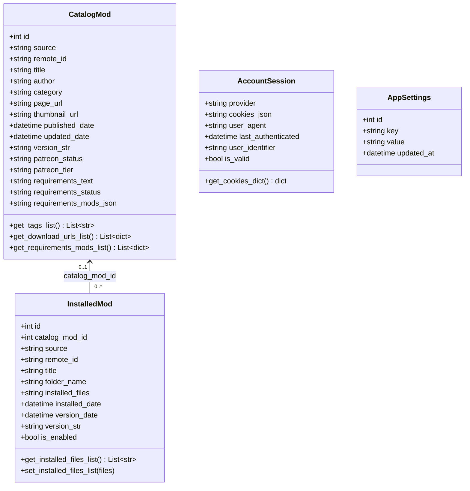
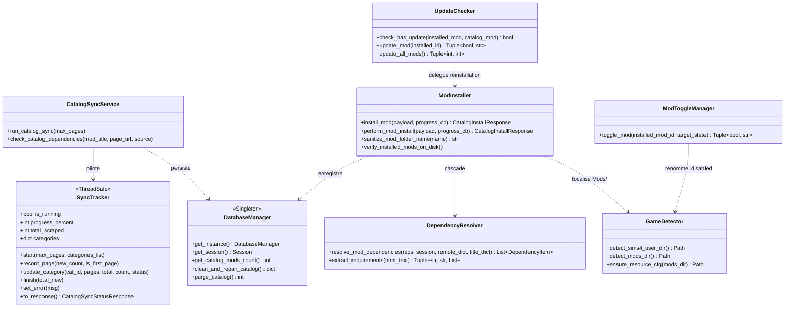
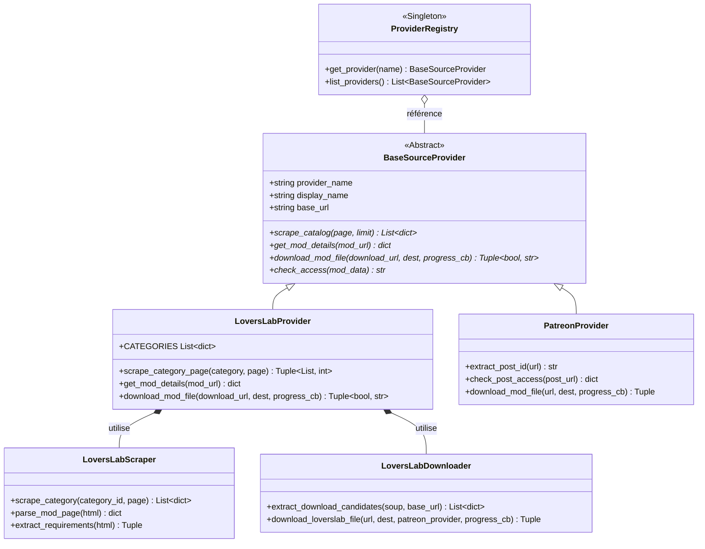
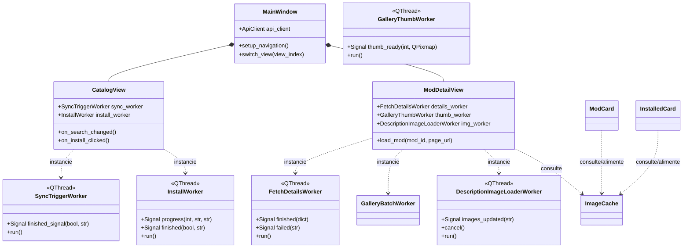
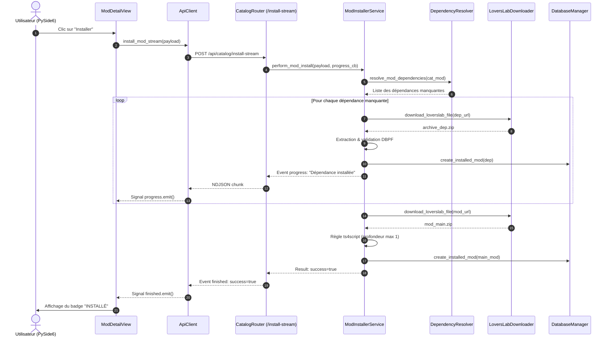

# Schémas de Liaisons et Diagrammes de Classes

Ce document détaille les relations, contrats d'interface et flux d'interaction entre les différentes classes et modules de **SIMS 4 Mods Manager**.

---

## 📊 1. Modèle de Données (ORM SQLAlchemy)

---

## ⚙️ 2. Couche Services & Orchestration

---

## 🔌 3. Couche Fournisseurs Externes (Providers)

---

## 🖥️ 4. Couche Interface Graphique & Workers Asynchrones

---

## 🔄 5. Séquence d'Installation d'un Mod avec Dépendances

